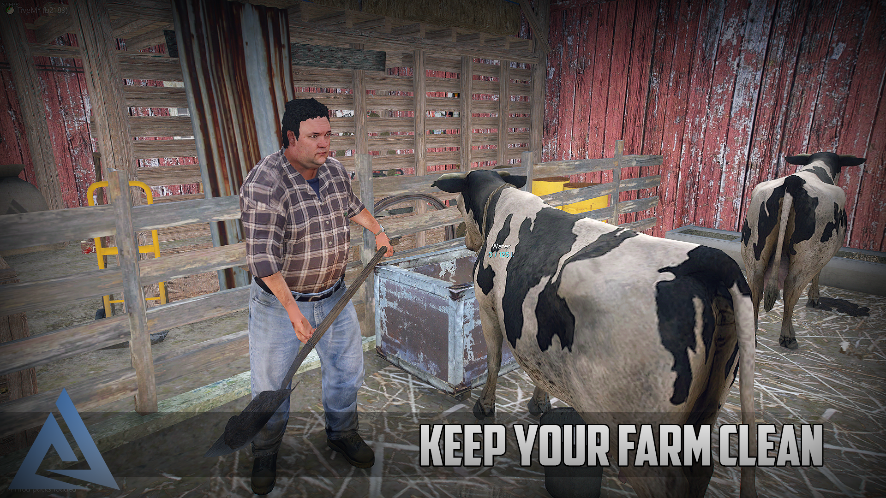
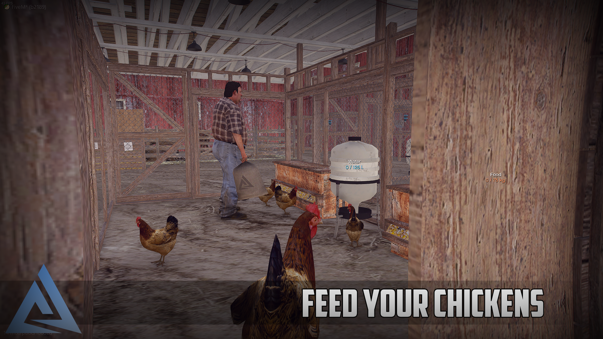
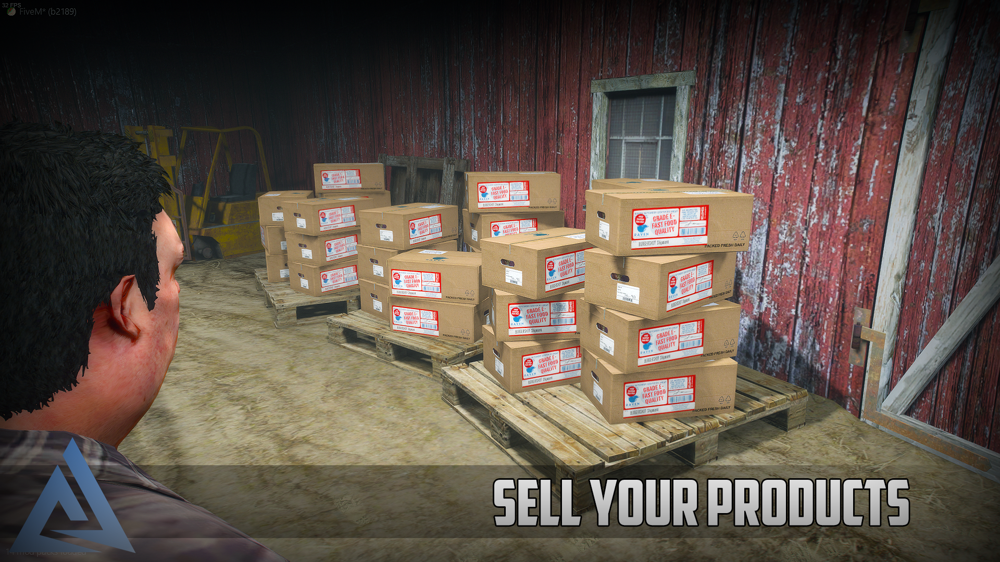

# Animal Farm

- [Animal Farm](#animal-farm)
  - [I have a question. (DISCORD)](#i-have-a-question-discord)
- [About](#about)
- [Subscription vs lifetime](#subscription-vs-lifetime)
  - [Why choose subscription ?](#why-choose-subscription-)
- [Features](#features)
- [Dependencies](#dependencies)
- [Installation](#installation)
- [FAQ](#faq)
  - [Does the animals move?](#does-the-animals-move)
  - [Can I delete a created farm with a command?](#can-i-delete-a-created-farm-with-a-command)
  - [Players can hear each other in diferent farm(s)](#players-can-hear-each-other-in-diferent-farms)
  - [Object and Ped dimension(s)](#object-and-ped-dimensions)
- [Images](#images)

## [I have a question. (DISCORD)](https://discord.gg/zRnrHuPCYZ)

# About

This resource is standalone, so it is not linked to any framework, comes from that you will need to adjust some functions to fit your server, explanations below.

The script is written in **Typescript**, so you will have to compile the server and clientside in order to make the script start.

We tried to balance the script with our calculations, but every server has a different economy system, if you do not want to calculate everything through, we made a variable for you which changes globally the prices for everything.

# Subscription vs lifetime
This resource is not about simplicity, we can not guarantee that your server will run this script with +200 players without lag. (We could not test it with that many players.)

## Why choose subscription ?
So you can try the script, test it out with your friends and see if it runs well on your server.

# Features
We have made a custom modelled interior shell for the Animal Farm which is basically a Barn, so the interior is always in one fixed position, so i had to make a custom dimensional system which handles the object and every other entities.

Comes from the Dimension system, you can create as many farms as you want, it will eat up more memory and usage on the serverside, but on the clientside, the farm objects and other necessary things only loading when you enter the farm, so the script idling is around 0.02-0.04ms.

If you are inside the farm it will cost more performance, because everything is in a 'small' modelled interior, and need to render many things, but the render tickers are editable if you want to reduce the CPU usage, but i do not recommend it. We had around 170-180 fps inside the interior.

* Custom dimensional manager for Objects / Players / Particles / Peds, etc.
* Custom attachment handler.
* Raycast on objects / peds.
* Upgrading system
* Animal buying
* Available animals:
  - Chicken (generating Egg [passively])
  - Cow (Milk [gather])
  - Pig (Meal [gather])
* Every math is configable if you want to mess with the numbers.
* Our modelled/edited props (Blender):
  - Animal Farm base shell (Barn)
  - Chicken paddock
  - Basic paddock
  - Composter
  - Chicken feeder
  - Chicken drinker
  - Rabbit cages
  - Bucket with states (Milk, Water, Empty)
  - And other props modified. (Shovel made for hand, etc.)
* I could write a bunch of many things, but everything is shown in the Video, its easier if you watch it.

> # Escrow: **YES** (.lua)

# Dependencies
* Mysql (npm will automatically install it for you and will be packed.)
* NodeJS (for installing with npm.)
* Server version atleast 4752. (to support lua54 & escrow)
* OneSync **ON** (For serverside player teleporting/distancing, etc. You can easily make the script to non onesyne if you sync the player-position to server, etc.)

# Installation
1. Extract the .zip file and copy paste the content into your resources folder. (The resource name needs to be named: `aquiver_animalfarm`)
2. Install the npm dependencies, by starting the `install_dep.bat`. path: `dev/install_dep.bat`.
3. Entire config file is inside: `shared-config.ts`, path: `source-files/shared/shared-config.ts`. (Almost every variable has a description.)
4. Modify the Mysql connection settings in the `shared-config.ts`.
5. Import the `.sql` file into your database.
6. Change the Banking and other functions inside the `config.lua` file. path: `files/config.lua`. Here you can import your framework and setup the functions easily.
7. Change the translations inside the `shared-translations.ts`. path: `source-files/shared/shared-translations.ts`.
8. If you are finished with everything, you need to compile the Typescript files. I made an easy setup for you, inside the `dev` folder you just start the `compile.bat` file and it will compile every files for you in the proper directory.

# FAQ
## Does the animals move?
It was planned to make them moving inside the paddocks, but for now they are in a stable random position.

## Can I delete a created farm with a command?
You can not delete a farm at the moment, but you do not even need to, if you created one, you can reposition/resell and basically do everything with it.\
Currently, you have to query your database to delete everything which is attached to the farm and restart the server.

## Players can hear each other in diferent farm(s)
Dimension system works with FiveM native `SetEntityRoutingBucket`, i guess the newer voice resources are upgraded for this solution.\
If your server has this issue, you should modify the voice resource by checking that the player-player `GetEntityRoutingBucket` are the same or not.

## Object and Ped dimension(s)
Objects and Peds are not affected by the `RoutingBucket`, they are handled by our custom dimension manager.\
They are created from our a serverside 'api', and only the necessary data is sent to the client so it can be created and streamed to every player who is inside.

# Images

